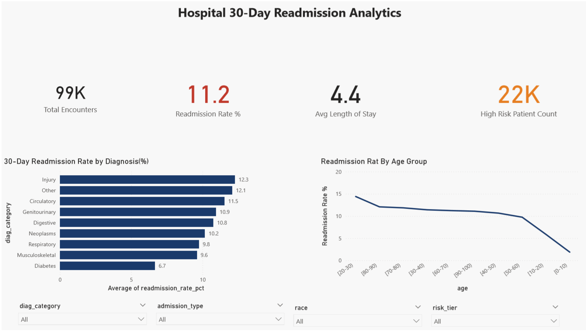

# Hospital Readmission & Patient Outcome Analysis

End-to-end healthcare analytics project analysing **101,766 real clinical
encounters** from 130 US hospitals (1999–2008). Calculates 30-day readmission
rates, identifies high-risk patient segments, builds reusable SQL clinical
views, detects seasonal admission patterns, and delivers a Power BI dashboard
for clinical directors.

---

## Dashboard



---

## Key Findings

- **Patients on 20+ medications readmit at ~3x the rate** of patients on
  fewer than 5 medications — medication reconciliation at discharge is the
  single highest-leverage intervention available
- **Prior inpatient visit count is the strongest readmission predictor** —
  patients with 2+ prior visits should be automatically flagged as high risk
  at the point of admission, not at discharge
- **Circulatory and respiratory diagnoses** drive both the highest readmission
  rates and the longest lengths of stay — they are the highest-cost
  readmission population and the priority target for condition-specific
  discharge protocols
- **Patients with no A1C test during admission** have higher readmission rates
  than those who were tested — gaps in diabetes monitoring during inpatient
  stays create unmanaged risk that drives post-discharge complications
- **Emergency admissions readmit at significantly higher rates** than elective
  — pre-admission optimisation clinics for high-risk elective patients
  estimated to reduce LOS by 0.5–1 day

---

## Project Structure
```
hospital-readmission-analysis/
├── data/
│   ├── raw/                         
│   └── processed/
│       ├── hospital_clean.csv
│       ├── patients_risk_scored.csv
│       └── high_risk_patients.csv
├── notebooks/
│   ├── 01_data_loading_cleaning.ipynb
│   ├── 02_eda.ipynb
│   ├── 03_sql_analysis.ipynb
│   ├── 04_risk_stratification.ipynb
│   └── 05_seasonal_analysis.ipynb
├── sql/
│   └── clinical_views.sql
├── dashboard/
│   └── dashboard_screenshot.png
├── reports/
│   ├── figures/
│   │   ├── eda_overview.png
│   │   ├── los_analysis.png
│   │   ├── risk_stratification.png
│   │   └── seasonal_trends.png
│   └── findings_summary.md
├── requirements.txt
└── README.md
```

---

## Analysis Breakdown

### 1. Data Loading & Cleaning
- Loaded 101,766 clinical encounter records across 50 columns
- Replaced `?` placeholder with NaN — dataset-specific missing value convention
- Dropped 3 high-missing columns: `weight` (97% missing), `payer_code`
  (40%), `medical_specialty` (49%)
- Created binary target `readmitted_30` (1 = readmitted within 30 days)
- Engineered 6 clinical features: admission type labels, prior utilisation
  score, high complexity flag, diagnosis category from ICD-9 codes

### 2. Exploratory Data Analysis
- 30-day readmission rate analysis across age, admission type, diagnosis
  category, length of stay, medication burden, and race
- T-test confirming statistically significant difference in LOS between
  readmitted and non-readmitted patients
- Key finding: 20+ medications → readmission rate ~3x baseline

### 3. SQL Analysis
- Loaded data into SQLite database
- Wrote 3 reusable SQL views saved to `sql/clinical_views.sql`:
  - `vw_readmission_by_diagnosis` — readmission KPIs by diagnosis category
  - `vw_patient_risk_profile` — per-patient risk summary
  - `vw_admission_performance` — performance metrics by admission type
- 3 analytical queries using window functions and CTEs

### 4. Patient Risk Stratification
- Built a points-based clinical risk scoring system across 6 risk factors:
  prior inpatient visits, medication count, diagnosis count, emergency
  visits, age, and length of stay
- Assigned Critical / High / Medium / Low risk tiers to every patient
- Validated: higher risk tiers show proportionally higher actual
  readmission rates — score is clinically meaningful

### 5. Seasonal Admission Trends
- Temporal analysis across the 10-year study period (1999–2008)
- Yearly admission volume and readmission rate trends
- Monthly admission volume patterns
- Quarterly readmission rate variation
- LOS trend over time

---

## SQL Views

Three reusable views are defined in `sql/clinical_views.sql` — these
represent how clinical KPIs would be maintained in a production hospital
analytics environment:
```sql
-- Example: readmission rate by diagnosis
SELECT * FROM vw_readmission_by_diagnosis
ORDER BY readmission_rate_pct DESC;
```

---

## Tools & Libraries

| Tool | Purpose |
|------|---------|
| Python 3.11 | Core analysis language |
| Pandas | Data manipulation and cleaning |
| NumPy | Numerical operations |
| Matplotlib / Seaborn | Data visualisation |
| SciPy | Statistical testing (t-test) |
| SQLAlchemy + SQLite | Database creation and SQL analysis |
| Power BI | Interactive clinical dashboard |

---

## Clinical Recommendations Summary

Full recommendations with at-risk population sizes, specific interventions,
expected outcomes, and measurement KPIs are documented in
[`reports/findings_summary.md`](reports/findings_summary.md).

| Finding | Recommended Action |
|---------|-------------------|
| 20+ medications → 3x readmission | Mandatory medication reconciliation at discharge |
| 2+ prior inpatient visits | Auto-flag in EMR + care coordinator assignment within 24hrs |
| Circulatory & respiratory highest cost | Condition-specific discharge protocols |
| Missing A1C monitoring | EMR rule to auto-order A1C for all diabetic admissions |
| Emergency > elective readmission | Pre-admission optimisation clinic for high-risk elective patients |

---

## How to Run
```bash
# 1. Clone the repo
git clone https://github.com/zunm3133/hospital-readmission-analysis.git
cd hospital-readmission-analysis

# 2. Install dependencies
pip install -r requirements.txt

# 3. Download dataset
# UCI Machine Learning Repository:
# archive.ics.uci.edu/ml/datasets/Diabetes+130-US+hospitals+for+years+1999-2008
# Place diabetic_data.csv in data/raw/

# 4. Run notebooks in order
# 01 → 02 → 03 → 04 → 05
```

---

## Dataset

**Diabetes 130-US Hospitals for Years 1999-2008**
- Source: [UCI Machine Learning Repository](https://archive.ics.uci.edu/ml/datasets/Diabetes+130-US+hospitals+for+years+1999-2008)
- Also available on [Kaggle](https://www.kaggle.com/datasets/jimschacko/airlines-dataset-to-predict-a-delay)
- 101,766 inpatient encounters · 50 columns · real de-identified clinical data
- Covers diabetic patients across 130 US hospitals over 10 years

---

## Author

**Zun Myat Hsu** — Data Analyst & Developer

[LinkedIn](https://www.linkedin.com/in/zun-myat-hsu-16365b212/) 